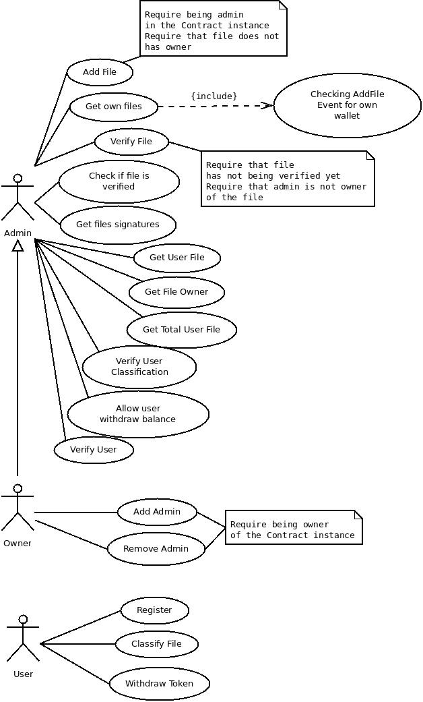

## Machine Learning Token

  The Machine Learning Token (MLT) is an ERC20 Token in the Ethereum network that is used as a reward for users who help with file classifications. The goal of this project is to make a decentralized application that allows users to sort files and earn MLT as a reward. The main idea is that some research groups need to classify a large amount of data to apply all classifications in machine learning algorithms in order to predict what type of data is through analyzes of some characteristics of that data.
  In this example, news articles related to Bitcoin and Cryptocurrencies will be used and users will have to classify if these news are "Good", "Bad" or "Neutral". Later, all classifications of this news will be used in machine learning algorithms to predict whether any article is "Good", "Bad" or "Neutral" for the world of cryptocurrencies based on the groups of words that this article has.
  The TokenClassificator smart contract aims to store MLT, allow users to classify articles that are on [Interplanetary File System (IPFS)](https://ipfs.io), allow the owner to add administrators to the contract, allow administrators to check the classifications that users have made and allow users to withdraw tokens when their classifications are verified by administrators. When an administrator include an IPFS hash of some file in the smart contract others administrators need to verify this file in order to users be able to classify them.

### Cases of Use

Functionalities of the contracts can be illustrated in a UML Case of Use Diagram.




### Getting Started

The dapp was made using the [pet shop tutorial](https://truffleframework.com/tutorials/pet-shop) and modified as required.

**Tested on Ubuntu 16.04**

### Pre requisites

To run the dapp in localhost you will need to install the following packages:

* NodeJs and NPM

```
$ sudo apt update
$ sudo apt install nodejs npm
```

* Ganache-cli

```
$ npm install -g ganache-cli
```

* Truffle version 4.1.14

```
$ npm install -g truffle@4.1.14
```

* Metamask browser extension

Instructions at [https://metamask.io](https://metamask.io)

* IPFS (not required for testing)

```
$ wget https://dist.ipfs.io/go-ipfs/v0.4.18/go-ipfs_v0.4.18_linux-amd64.tar.gz
$ tar xvfz go-ipfs.tar.gz
$ cd go-ipfs
$ ./install.sh
```

### Running Dapp example

Install git if not installed and clone this repository

```
# if git is not installed run first
# $ sudo apt-get install git-core
$ git clone 
# Move to the directory and open another terminal after
$ cd 
```

Start a ganache private blockchain in another terminal

```
# Second terminal
$ ganache-cli
```

Compile and migrate Smart Contracts using the first terminal

```
# First terminal
$ truffle compile
$ truffle migrate
```

Test contracts

```
$ truffle test
```

Insert sample of files, add administrator and a verified user in the test contract.

```
$ truffle exec script/insertHashes.js
```

Run development server

```
$ npm run dev
```

Use the seed or some private key generated by ganache to interact with the dapp using metamask connected to localhost:8545.
In this example your account[0] is owner, account[1] is admin and account[2] is verfied user.


### Informations

This project could be done thanks to the Consensys Ethereum Developer Bootcamp Online 2018 and it is a continuation of the project done as [Course Project](https://github.com/henrique1837/ConsensysDevProgram2018). The data could be scraped thanks to all knowloged learned in the Researcher Fellowship in NMEC - FGV. Next step is to finish the TokenClassificator smart contract and to publish it in the Ropsten Test Network and the dApp in the IPFS.
